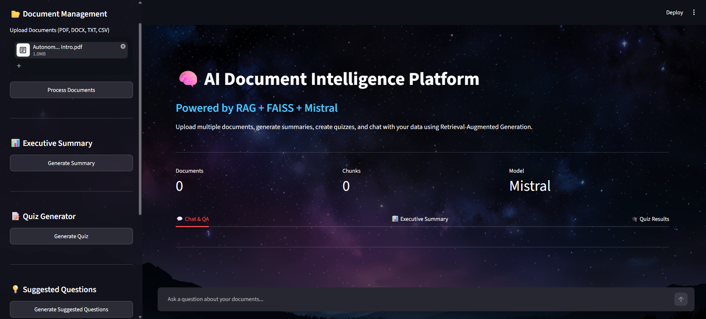
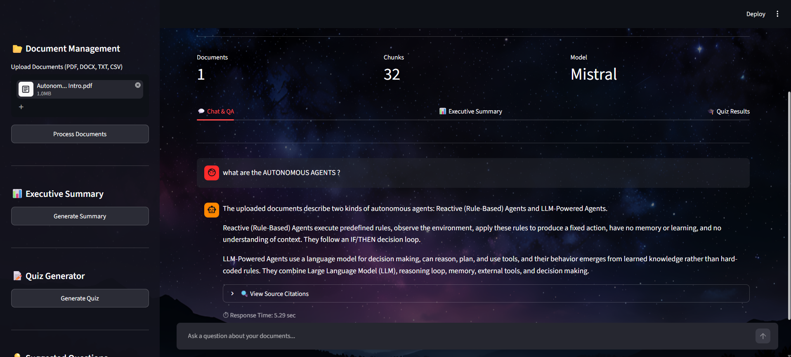
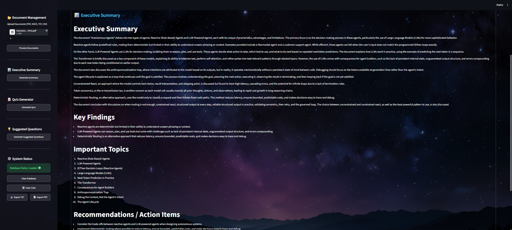
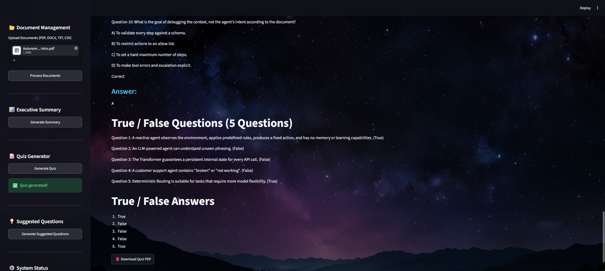
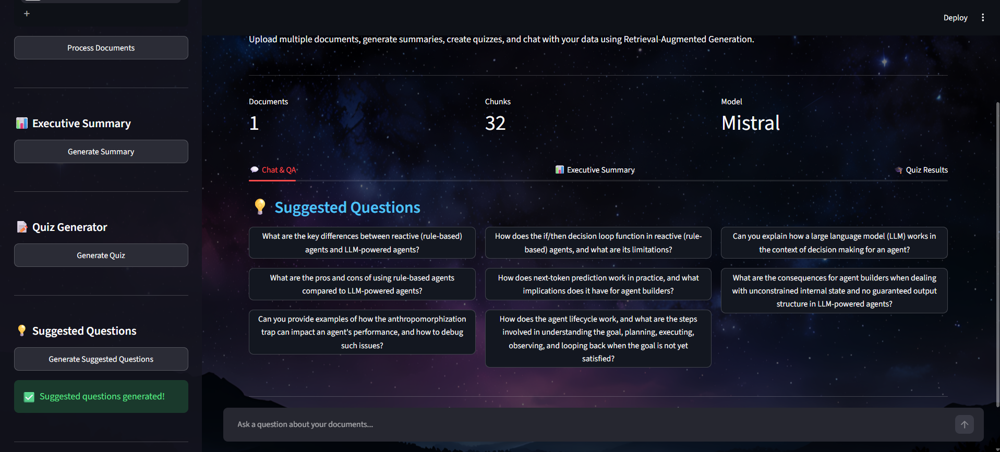

# 🚀 [Tips Hindawi](https://www.tipshindawi.com/) Challenge (June–July) 2026

> 🏆 This repository is my official submission for the [ **Tips Hindawi** ](https://www.tipshindawi.com/) **Challenge (June–July) 2026**.

## 👤 Participant

| Field            | Value                                |
| ---------------- | ------------------------------------ |
| Full Name        | Mohammad Hesham Hassan                                     |
| Project Name     | AI Document Intelligence Platform                                      |
| GitHub Username  | mohesham100                                     |
| Challenge Batch  | June–July 2026                       |
| Training Program | Large Language Models (LLMs) Program |
| Organization     | [**Edrak for Ai**](https://edrak4ai.com/en)                         |

---

# 📖 Project Overview

AI Document Intelligence Platform is an end-to-end Retrieval-Augmented Generation (RAG) application that allows users to upload documents, create vector embeddings, generate executive summaries, build quizzes automatically, and interact with their documents through a conversational AI interface.

The system combines document processing, semantic search, FAISS vector databases, local LLM inference using Mistral via Ollama, and an interactive Streamlit interface to provide intelligent document analysis without relying on external cloud-based LLM APIs.

The platform supports PDF, DOCX, TXT, and CSV files and enables users to extract insights from large collections of documents efficiently.

---

# ✨ Features

- Upload and process PDF, DOCX, TXT, and CSV documents.
- Automatic document chunking and embedding generation.
- Local vector database using FAISS.
- Retrieval-Augmented Generation (RAG) pipeline.
- Conversational document Q&A.
- Executive Summary generation.
- Automatic Quiz Generation.
- Suggested Questions generation.
- Source citation tracking for answers.
- Chat history export (TXT/PDF).
- Fully local LLM inference using Mistral and Ollama.
- Interactive Streamlit dashboard.

---

# 🛠️ Technologies Used

### Backend
- Python
- LangChain
- FAISS
- Ollama
- Mistral LLM

### AI & NLP
- Sentence Transformers
- HuggingFace Embeddings
- Retrieval-Augmented Generation (RAG)

### Frontend
- Streamlit

### Document Processing
- PyPDF2
- python-docx
- Pandas

### Utilities
- dotenv
- ReportLab

---

# ⚙️ Installation

# Clone Repository
git clone https://github.com/YOUR_USERNAME/YOUR_REPO.git

cd YOUR_REPO

# Create Virtual Environment
python -m venv venv

# Activate Environment

# Windows
venv\Scripts\activate

# Install Dependencies
pip install -r requirements.txt

# Install Ollama
https://ollama.com/download

# Pull Mistral Model
ollama pull mistral

# Run Application
streamlit run app.py

---

# 🚀 Usage

1. Launch the application.
2. Upload one or more documents.
3. Click "Process Documents".
4. Ask questions about your uploaded content.
5. Generate executive summaries.
6. Generate quizzes automatically.
7. Generate suggested questions.
8. Export results and chat history.

---

# 📸 Demo

## Main Dashboard

## Chat Interface

## Executive Summary

## Quiz Generator

## Suggested Questions 

---

# 📈 Results

- Successfully processes multi-document collections.
- Generates context-aware answers using Retrieval-Augmented Generation.
- Supports semantic search across large documents.
- Produces structured executive summaries.
- Creates educational quizzes automatically from uploaded content.
- Runs entirely on local infrastructure using Ollama and Mistral.
---

# 🔮 Future Improvements

- Multi-user authentication system.
- Persistent chat memory across sessions.
- Support for additional LLMs.
- Advanced citation highlighting.
- Document comparison mode.
- Voice-based interaction.
- PDF report generation for summaries and quizzes.
- GPU-optimized inference pipeline.

---

# 📚 About the Challenge

This project was developed as part of the [**Tips Hindawi**](https://www.tipshindawi.com/) **Challenge (June–July) 2026**.

[Tips Hindawi](https://www.tipshindawi.com/) is the internships department of [**Edrak for Ai**](https://edrak4ai.com/en), and the challenge encourages participants to build real-world projects, apply practical skills, and showcase their work through GitHub.

For more information about the challenge, training programs, and upcoming batches, visit the official [Tips Hindawi](https://www.tipshindawi.com/) website.

---

# 📄 License

This project is shared for educational and portfolio purposes.
